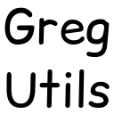
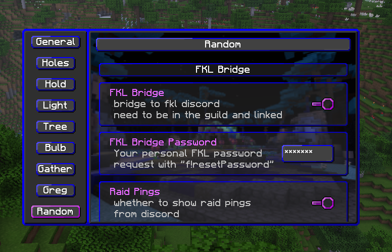
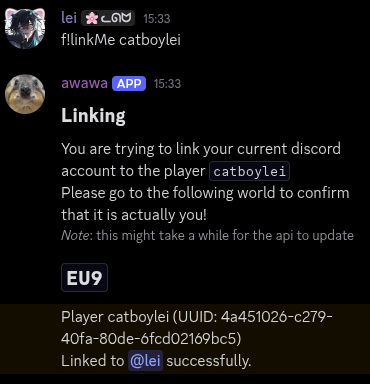
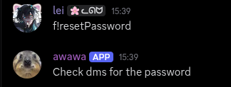
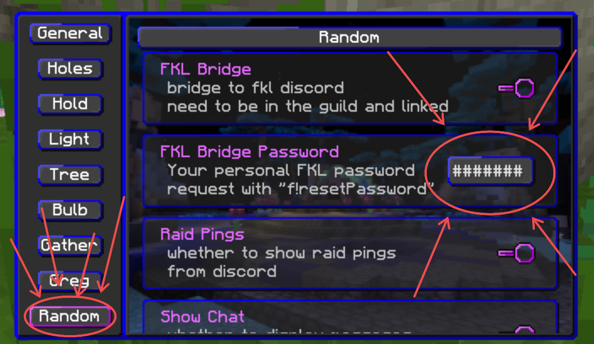

    

# Gregory Utilities

> [!NOTE] 
> 
> **this mod is still a heavy work-in-progress ! feel free to report any bugs to @catboylei on discord**

This silly goober mod aims to add some much needed qol to tna as well as some FKL-specific features, from yours truly

also meow mraow mrrp purr mrreaw purrrr :3

## Config

Open the config gui through modmenu or the command that i forgor to add

## Features

obviously many more planned eventually

- client-side FKL discord bridge
- Tree Path highlight
- very cool gui

## How to enable the bridge 

> [!IMPORTANT]
> This will NEVER ask for any email address or external passwords/codes. We only use the internal awawa password as to manage who has access to the bridge.

Tutorial

<i>Make sure to run discord commands in #bot-channel !</i>

1. Link your account on awawa

    Run `f!linkMe <ign>`, then join the specified wynncraft world.*

    

    <i>*Do note that you may have to wait on the API.</i>

2. Request your password

    Now run `f!resetPassword` for the bot to generate you a new personal key.

    

3. Input your password into the mod

    Now just enter that password into the mod, and you are done! \
    (go into the Random category and paste the password into the password field)

    

## Back-end

eventually these will be made into public helpers so you can reference them from other mods :p

- Highlight block at coords
- Mappings for (some) Wynncraft textures
- Pre-made Wynncraft chat components (e.g. the discord banner)

## Credits

- @citr_n for discord back-end
- [more-outlines](https://github.com/burneikis/more-outlines) for inspiring the block highlight
- [FKL discord](https://discord.gg/CN4GfgXZMm)

--- 

